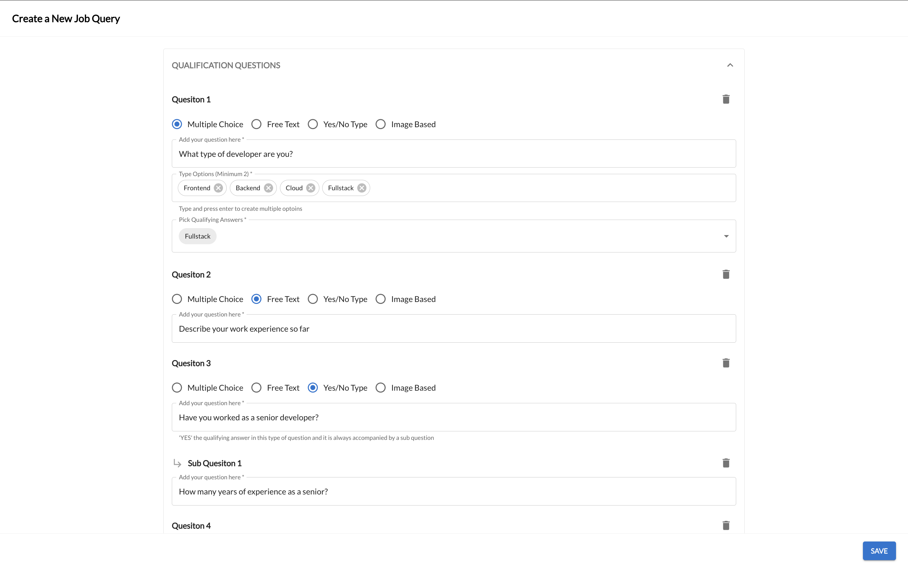
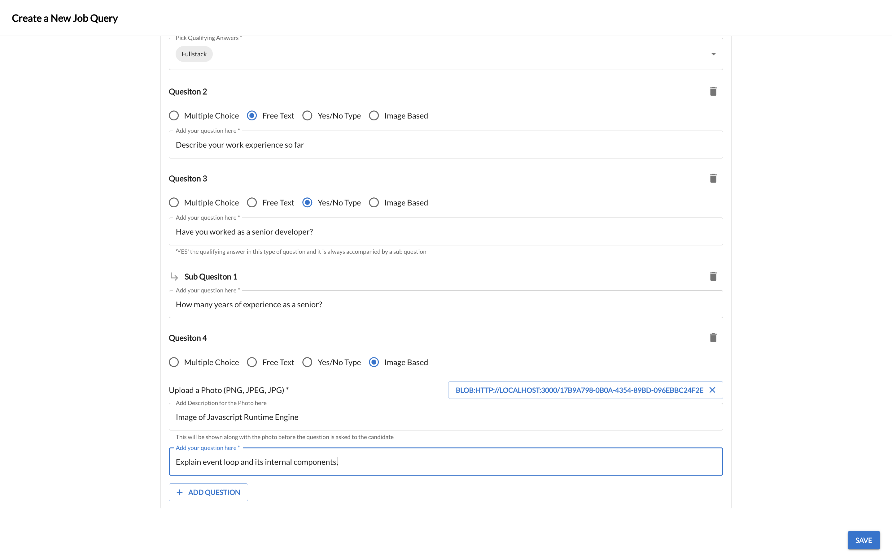
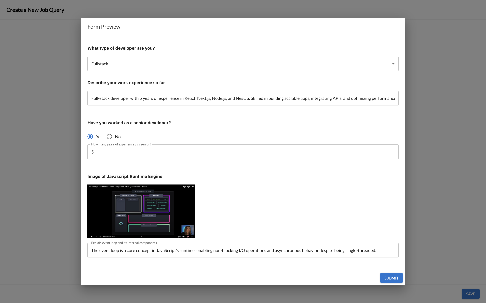

# Getting Started with Create React App

This project was bootstrapped with [Create React App](https://github.com/facebook/create-react-app).

## Technology Used

- **React**: Used for building dynamic and responsive user interfaces with a component-based architecture.  
- **useReducer**: Implemented for state management to handle complex state logic with a predictable and organized structure.  
- **Material UI**: Utilized for designing professional and modern interfaces with pre-styled components and customizable theming.  

## Screen Shots

## Available Scripts

In the project directory, you can run:

### `npm start`

Runs the app in the development mode.\
Open [http://localhost:3000](http://localhost:3000) to view it in your browser.

The page will reload when you make changes.\
You may also see any lint errors in the console.

### `npm test`

Launches the test runner in the interactive watch mode.\
See the section about [running tests](https://facebook.github.io/create-react-app/docs/running-tests) for more information.

### `npm run build`

Builds the app for production to the `build` folder.\
It correctly bundles React in production mode and optimizes the build for the best performance.

The build is minified and the filenames include the hashes.\
Your app is ready to be deployed!

See the section about [deployment](https://facebook.github.io/create-react-app/docs/deployment) for more information.

### `npm run format`

Code formatting with Prettier ensures consistency across a codebase, making it easier for teams to read, maintain, and collaborate effectively. It automates styling decisions, reducing debates over code style and improving developer productivity.

